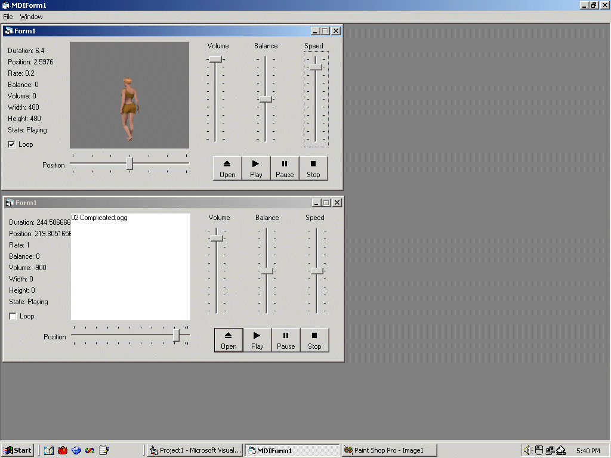



## AVI, MP3, WMA, Ogg, Midi, and more player\!

### Description

This program allows you to play audio and video files in various formats, including MP3, Ogg, WAV, WMA, AVI, and more. It uses DirectShow, and doesn't require any DLL's or custom OCX's.
 
### More Info
 

             |
---                |---
**Submitted On**   |2003-10-18 17:47:00
**By**             |[Kamilche](https://github.com/Planet-Source-Code/PSCIndex/blob/master/ByAuthor/kamilche.md)
**Level**          |Intermediate
**User Rating**    |4.7 (71 globes from 15 users)
**Compatibility**  |VB 5\.0
**Category**       |[Complete Applications](https://github.com/Planet-Source-Code/PSCIndex/blob/master/ByCategory/complete-applications__1-27.md)
**World**          |[Visual Basic](https://github.com/Planet-Source-Code/PSCIndex/blob/master/ByWorld/visual-basic.md)
**Archive File**   |[AVI\_\_MP3\_\_16606110182003\.zip](https://github.com/Planet-Source-Code/kamilche-avi-mp3-wma-ogg-midi-and-more-player__1-49332/archive/master.zip)

